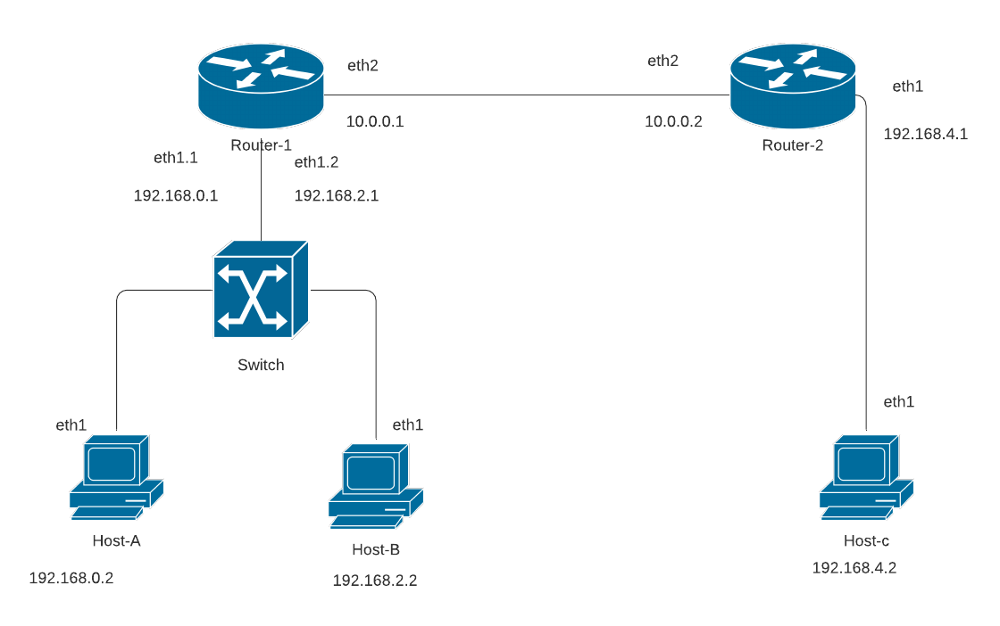

# DNCS-LAB

This repository contains the Vagrant files required to run the virtual lab environment used in the DNCS course.
```


        +-----------------------------------------------------+
        |                                                     |
        |                                                     |eth0
        +--+--+                +------------+             +------------+
        |     |                |            |             |            |
        |     |            eth0|            |eth2     eth2|            |
        |     +----------------+  router-1  +-------------+  router-2  |
        |     |                |            |             |            |
        |     |                |            |             |            |
        |  M  |                +------------+             +------------+
        |  A  |                      |eth1                       |eth1
        |  N  |                      |                           |
        |  A  |                      |                           |
        |  G  |                      |                     +-----+----+
        |  E  |                      |eth1                 |          |
        |  M  |            +-------------------+           |          |
        |  E  |        eth0|                   |           |  host-c  |
        |  N  +------------+      SWITCH       |           |          |
        |  T  |            |                   |           |          |
        |     |            +-------------------+           +----------+
        |  V  |               |eth2         |eth3                |eth0
        |  A  |               |             |                    |
        |  G  |               |             |                    |
        |  R  |               |eth1         |eth1                |
        |  A  |        +----------+     +----------+             |
        |  N  |        |          |     |          |             |
        |  T  |    eth0|          |     |          |             |
        |     +--------+  host-a  |     |  host-b  |             |
        |     |        |          |     |          |             |
        |     |        |          |     |          |             |
        ++-+--+        +----------+     +----------+             |
        | |                              |eth0                   |
        | |                              |                       |
        | +------------------------------+                       |
        |                                                        |
        |                                                        |
        +--------------------------------------------------------+


```

# Requirements
 - Python 3
 - 10GB disk storage
 - 2GB free RAM
 - Virtualbox
 - Vagrant (https://www.vagrantup.com)
 - Internet

# How-to
 - Install Virtualbox and Vagrant
 - Clone this repository
`git clone https://github.com/fabrizio-granelli/dncs-lab`
 - You should be able to launch the lab from within the cloned repo folder.
```
cd dncs-lab
[~/dncs-lab] vagrant up
```
Once you launch the vagrant script, it may take a while for the entire topology to become available.
 - Verify the status of the 4 VMs
 ```
 [dncs-lab]$ vagrant status                                                                                                                                                                
Current machine states:

router                    running (virtualbox)
switch                    running (virtualbox)
host-a                    running (virtualbox)
host-b                    running (virtualbox)
```
- Once all the VMs are running verify you can log into all of them:
`vagrant ssh router`
`vagrant ssh switch`
`vagrant ssh host-a`
`vagrant ssh host-b`
`vagrant ssh host-c`

# Assignment
This section describes the assignment, its requirements and the tasks the student has to complete.
The assignment consists in a simple piece of design work that students have to carry out to satisfy the requirements described below.
The assignment deliverable consists of a Github repository containing:
- the code necessary for the infrastructure to be replicated and instantiated
- an updated README.md file where design decisions and experimental results are illustrated
- an updated answers.yml file containing the details of your project

## Design Requirements
- Hosts 1-a and 1-b are in two subnets (*Hosts-A* and *Hosts-B*) that must be able to scale up to respectively 335 and 345 usable addresses
- Host 2-c is in a subnet (*Hub*) that needs to accommodate up to 272 usable addresses
- Host 2-c must run a docker image (dustnic82/nginx-test) which implements a web-server that must be reachable from Host-1-a and Host-1-b
- No dynamic routing can be used
- Routes must be as generic as possible
- The lab setup must be portable and executed just by launching the `vagrant up` command

## Tasks
- Fork the Github repository: https://github.com/fabrizio-granelli/dncs-lab
- Clone the repository
- Run the initiator script (dncs-init). The script generates a custom `answers.yml` file and updates the Readme.md file with specific details automatically generated by the script itself.
  This can be done just once in case the work is being carried out by a group of (<=2) engineers, using the name of the 'squad lead'. 
- Implement the design by integrating the necessary commands into the VM startup scripts (create more if necessary)
- Modify the Vagrantfile (if necessary)
- Document the design by expanding this readme file
- Fill the `answers.yml` file where required (make sure that is committed and pushed to your repository)
- Commit the changes and push to your own repository
- Notify the examiner (fabrizio.granelli@unitn.it) that work is complete specifying the Github repository, First Name, Last Name and Matriculation number. This needs to happen at least 7 days prior an exam registration date.

# Notes and References
- https://rogerdudler.github.io/git-guide/
- http://therandomsecurityguy.com/openvswitch-cheat-sheet/
- https://www.cyberciti.biz/faq/howto-linux-configuring-default-route-with-ipcommand/
- https://www.vagrantup.com/intro/getting-started/


# Design

The network was designed following the requirements found in the updated answers.yml file, calculating the most efficient subnettings. Between the routers
a class A adress is used with only 2 usable IP adresses, while for the other 3 subnets a class C was implemented. All of them needed more than 254 adresses so the choosen mask was 255.255.254.0
Subnet|Needed IPs|Netmask|Available IPs|Assigned IP block|
|:----:|:-------:|:-----:|:----------:|:----------------:|
|__Subnet-1__|335|23|2<sup>32-23</sup>-2=512|191.168.0.0/23|
|__Subnet-2__|345|23|2<sup>32-23</sup>-2=512|192.168.2.0/23|
|__Subnet-3__|272|23|2<sup>32-23</sup>-2=512|192.168.4.0/23|
|__Subnet-4__|2|30|2<sup>32-30</sup>-2=2|10.0.0.0/30|

# VLAN
Because there is only one phisical interface between the router and the switch, dividing it into two subinterfaces was the optimal choice. And two VLANS were implemented for the Host-A and Host-B subnets.
- Hosts-A belongs to **VLAN 10**
- Hosts-B belongs to **VLAN 20** 

The switch ports for using VLANs have been set as follow:
- Ports to hosts-A and hosts-B set to **access mode**
- Port to router-1 set to **trunk mode**

# IP config

| Device   | Interface predictable name | Interface | IP          | Subnet |
| -------- | -------------------------- | --------- | ----------- | ------ |
| Router-1 | enp0s9                     | eth2      | 10.0.0.1    | 1      |
| Router-2 | enp0s9                     | eth2      | 10.0.0.2    | 1      |
| Router-1 | enp0s8                     | eth1.10   | 192.168.0.1 | 2      |
| Host-A   | enp0s8                     | eth1      | 192.168.0.2 | 2      |
| Router-1 | enp0s8                     | eth1.20   | 192.168.2.1 | 3      |
| Host-B   | enp0s8                     | eth1      | 192.168.2.2 | 3      |
| Router-2 | enp0s8                     | eth1      | 192.168.4.1 | 4      |
| Host-C   | enp0s8                     | eth1      | 192.168.4.2 | 4      |

# Implementation

### host-a.sh
```
export DEBIAN_FRONTEND=noninteractive

sudo su

#INTERFACE CONFIGURATION
#set up IP address to the interface
ip addr add 192.168.0.2/23 dev enp0s8
#brings the interface up
ip link set enp0s8 up

#STATIC ROUTING
#sets the default gateway on router-1
ip route add default via 192.168.0.1
```

### host-b.sh

```
export DEBIAN_FRONTEND=noninteractive

sudo su

#INTERFACE CONFIGURATION
#set up IP address to the interface
ip addr add 192.168.2.2/23 dev enp0s8
#brings the interface up
ip link set enp0s8 up

#STATIC ROUTING
#sets the default gateway on router-1
ip route add default via 192.168.2.1
```

### host-c.sh

```
export DEBIAN_FRONTEND=noninteractive

sudo su

#Configuration of network interface
ip addr add 192.168.4.2/23 dev enp0s8
ip link set enp0s8 up

#Docker installation
apt-get update
apt-get install -y apt-transport-https ca-certificates curl software-properties-common
#Add Docker’s official GPG key:
curl -fsSL https://download.docker.com/linux/ubuntu/gpg | apt-key add -
add-apt-repository "deb [arch=amd64] https://download.docker.com/linux/ubuntu $(lsb_release -cs) stable"
apt-get update

#install the latest version of Docker Engine and containerd
apt-get install -y docker-ce docker-ce-cli containerd.io
#pull and run nginx-test from docker-hub
docker pull dustnic82/nginx-test
docker run -d -p 80:80 dustnic82/nginx-test

#Setting up default gateway
ip route add default via 192.168.4.1
```

### switch.sh

```
export DEBIAN_FRONTEND=noninteractive
apt-get update
apt-get install -y tcpdump
apt-get install -y openvswitch-common openvswitch-switch apt-transport-https ca-certificates curl software-properties-common

# Startup commands for switch go here
sudo su

#BRIDGE CREATION
#creates a new bridge called switch
ovs-vsctl add-br switch

#INTERFACE CONFIGURATION
#creates a trunk port
ovs-vsctl add-port switch enp0s8

#creates an access port on VLAN 10
ovs-vsctl add-port switch enp0s9 tag=10

#creates an access port on VLAN 20
ovs-vsctl add-port switch enp0s10 tag=20

#brings the interfaces up
ip link set enp0s8 up
ip link set enp0s9 up
ip link set enp0s10 up
```

### router-1.sh

```
export DEBIAN_FRONTEND=noninteractive

sudo su

#IP FORWARDING
sysctl net.ipv4.ip_forward=1

#INTERFACE CONFIGURATION
#adds IP address to the interface
ip addr add 10.0.0.1/30 dev enp0s9
#brings the interface up
ip link set enp0s9 up

#SUBINTERFACES FOR VLANS
#creates the subinterface for VLAN 10
ip link add link enp0s8 name enp0s8.10 type vlan id 10
#adds IP address to the subinterface
ip addr add 192.168.0.1/23 dev enp0s8.10

#creates the subinterfaces for VLAN 20
ip link add link enp0s8 name enp0s8.20 type vlan id 20
#adds IP address to the subinterface
ip addr add 192.168.2.1/23 dev enp0s8.20

#set the interfaces up
ip link set enp0s8 up
ip link set enp0s8.10 up
ip link set enp0s8.20 up

#STATIC ROUTING
#deletes the dafault gateway
ip route del default
#creates a static route to reach subnet B via router-2
ip route add 192.168.4.0/23 via 10.0.0.2 dev enp0s9
```

### router-2.sh

```
export DEBIAN_FRONTEND=noninteractive

sudo su

#IP FORWARDING
sysctl net.ipv4.ip_forward=1

#INTERFACE CONFIGURATION
#add IP addresses to the interfaces
ip addr add 192.168.4.1/23 dev enp0s8
ip addr add 10.0.0.2/30 dev enp0s9

#brings the interfaces up
ip link set enp0s8 up
ip link set enp0s9 up

#STATIC ROUTING
#deletes the dafault gateway
ip route del default
#creates a static route to reach subnet A via router-1
ip route add 192.168.0.0/23 via 10.0.0.1 dev enp0s9
#creates a static route to reach subnet B via router-1
ip route add 192.168.2.0/23 via 10.0.0.1 dev enp0s9
```

# TEST

## curl 192.168.4.2 #host-c

```
<!DOCTYPE html>
<html>
<head>
<title>Hello World</title>
<link href="data:image/png;base64,iVBORw0KGgoAAAANSUhEUgAAAEAAAABACAYAAACqaXHeAAAGPElEQVR42u1bDUyUdRj/iwpolMlcbZqtXFnNsuSCez/OIMg1V7SFONuaU8P1MWy1lcPUyhK1uVbKcXfvy6GikTGKCmpEyoejJipouUBcgsinhwUKKKJ8PD3vnzsxuLv35Q644+Ue9mwH3P3f5/d7n6/3/3+OEJ/4xCc+8YQYtQuJwB0kIp+JrzUTB7iJuweBf4baTlJ5oCqw11C/JHp+tnqBb1ngT4z8WgReTUGbWCBGq0qvKRFcHf4eT/ZFBKoLvMBGIbhiYkaQIjcAfLAK+D8z9YhjxMgsVUGc84+gyx9AYD0khXcMfLCmUBL68HMZ+PnHxyFw3Uwi8B8hgJYh7j4c7c8PV5CEbUTUzBoHcU78iIl/FYFXWmPaNeC3q4mz5YcqJPI1JGKql2Z3hkcjD5EUznmcu6qiNT+Y2CPEoH3Wm4A/QERWQFe9QQ0caeCDlSZJrht1HxG0D3sOuCEiCA1aj4ZY3Ipzl8LiVtn8hxi5zRgWM8YYPBODF/9zxOLcVRVs+YGtwFzxCs1Bo9y+avBiOTQeUzwI3F5+kOwxsXkkmWNHHrjUokqtqtSyysW5gUHV4mtmZEHSdRkl+aELvcFIRN397gPPXD4ZgbxJW1S5OJdA60MgUAyHu1KfAz+pfCUtwr+HuQc8ORQ1jK4ZgGsTvcY5uQP5oYkY2HfcK5sGLpS6l1xZQwNn7Xkedp3OgMrWC1DX0Qwnms/A1rK9cF9atNVo18DP/3o5fF99BGo7LFDRWgMJJQaYQv/PyOcHySP0TITrBIhYb+WSHLrlNGEx5NeXgj2paW8C5rs46h3Dc3kt3G2Ogr9aqoes+f5RvbL1aJ5iXnKnxkfIEoB3N/zHeHAmF9ovwryvYvC9TysnICkEonPX212vvOU8+As6eS+QCDAw0aNLABq6LO8DkJMSSznMMEfScFFGwCJYXbDV7lq17RYIQu+QTYpjRUBM3gZQIt+cOwyTpWRpYBQRsKrgU4ceNS4JkCSxLI1+ZsIS0NvXB6sLE/tL5EQkQJKOm52YON9y7glqJkCSOqzrD6Uvc1wZ1EBA07V/IafmN4ckHG+ugJkSEHuVQQ0ENFy9BLP3R0NR4ymHJGRWFWBnZ6fPVwMBF9EDgrD2z0USqtoaHJKw49SBoZ2dWggIxmcEsvspYLLi4PKNDrvv68OfuKLt/68MqiJAan4Q0IpDm6G7r8fue692X4fI7PiByqA6AqygNh0XHIaClDOkpz9aGVRJABo8CTP+3sqfHZJQeqkSgvHZn+xaqEICKAlhECSGO60MWdVF4IcesDL/ExUSYN3okCrD31fqHZLwcWkq5owPVUoA3UcIgdBv10BrV7vdz3b39kBhw0kVE2BNirG/bqRghyPqIcBKQkKJcVgE1LQ1wR3S5ooqCDBKlSEUzGdyFBNwvq1RTQT0b4BOF5+BgoayCUqAtTLMSXsRzl6uHX8EONoUtXS2KCfAusOsyVwFLV1tznNAuzflAGxb+R/esGuodDcD0bUVbYLelhRf/mWD08ogdYtTjNwYbIsrORhBIwJMPOTWHh1i6Lriz107FUKviivcZvfp8WZvN8TmbVS2rtsHI8mMtn9gSe50KAz79yWw8490OGYpp8lsTUGictd3EA6PHVwB20+mYUNURo/aMs4dhqjsdcoOWGxH5yYu0g0P0EzFBd7DxZoVHY7aHmWtB6VunwhLB6P0gFULk6zhJnvnBw5HW9D9N5GkpQEjMBcQOg+JMBNxjMZgHISawvGZHiKw+0mybv5ozP0txgvk07AQvWxAoh98sXsur3RmwMStxIud9fiIzMAIXTV6yNqxHaH7gg1GA7bgxVvHfEjq1hAl10ZM/A46gO0x0bOPoiHpSEDvsMZhXVVbVRL4TLz2E140EK1dgsnnd9mBaHcmwuigJHeCGLkXvHNaNHOBP4J/HYmoGbGwsJU1ka0nAvM2ht40758ZNmvvRRJ24l3roMa7MxVq4jpRdyMRc8bh9wR0TyIRWdR9hzNXaJs3Ftif6KDWuBcBH0hErky2bNraV5E9jcBjiapE1ExHkO8iEY1OvjLTjAkugezh7ySqFUPoXHTtZAR7ncY4rRrYYgtcCtGHPUgmjEhPmiKXjXc/l4g6HfGJT3ziEw/If86JzB/YMku9AAAAAElFTkSuQmCC" rel="icon" type="image/png" />
<style>
body {
  margin: 0px;
  font: 20px 'RobotoRegular', Arial, sans-serif;
  font-weight: 100;
  height: 100%;
  color: #0f1419;
}
div.info {
  display: table;
  background: #e8eaec;
  padding: 20px 20px 20px 20px;
  border: 1px dashed black;
  border-radius: 10px;
  margin: 0px auto auto auto;
}
div.info p {
    display: table-row;
    margin: 5px auto auto auto;
}
div.info p span {
    display: table-cell;
    padding: 10px;
}
img {
    width: 176px;
    margin: 36px auto 36px auto;
    display:block;
}
div.smaller p span {
    color: #3D5266;
}
h1, h2 {
  font-weight: 100;
}
div.check {
    padding: 0px 0px 0px 0px;
    display: table;
    margin: 36px auto auto auto;
    font: 12px 'RobotoRegular', Arial, sans-serif;
}
#footer {
    position: fixed;
    bottom: 36px;
    width: 100%;
}
#center {
    width: 400px;
    margin: 0 auto;
    font: 12px Courier;
}

</style>
<script>
var ref;
function checkRefresh(){
    if (document.cookie == "refresh=1") {
        document.getElementById("check").checked = true;
        ref = setTimeout(function(){location.reload();}, 1000);
    } else {
    }
}
function changeCookie() {
    if (document.getElementById("check").checked) {
        document.cookie = "refresh=1";
        ref = setTimeout(function(){location.reload();}, 1000);
    } else {
        document.cookie = "refresh=0";
        clearTimeout(ref);
    }
}
</script>
</head>
<body onload="checkRefresh();">

<div class="info">
<p><span>Server&nbsp;address:</span> <span>172.17.0.2:80</span></p>
<p><span>Server&nbsp;name:</span> <span>f13f50a2b69a</span></p>
<p class="smaller"><span>Date:</span> <span>19/Mar/2021:13:39:47 +0000</span></p>
<p class="smaller"><span>URI:</span> <span>/</span></p>
</div>
<br>
<div class="info">
    <p class="smaller"><span>Host:</span> <span>192.168.4.2</span></p>
    <p class="smaller"><span>X-Forwarded-For:</span> <span></span></p>
</div>

<div class="check"><input type="checkbox" id="check" onchange="changeCookie()"> Auto Refresh</div>
    <div id="footer">
        <div id="center" align="center">
            Request ID: 50f62bcc4c5ab47d41c4a59899f5c6f5<br/>
            &copy; NGINX, Inc. 2018
        </div>
    </div>
</body>
</html>
```